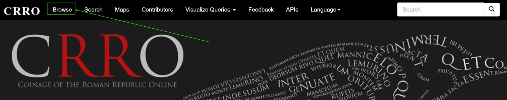
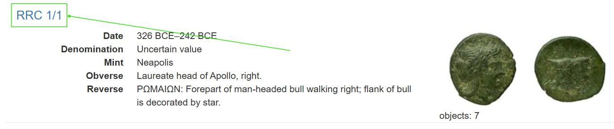

## Transferaufgaben

In dieser Übung verstehen Sie, wie Münzdatenbanken grundsätzlich aufgebaut sind, und wie die jeweiligen URLs aussehen. Dazu werden mit einfachen logischen Argumenten Münzen von Hadrian in verschiedenen Münzdatenbanken identifiziert. Die hier erlernten Grundkenntnisse benötigen Sie, um im folgenden Kapitel die passenden Informationen aus den jeweiligen URLs zu extrahieren.


Navigieren Sie in einem neuen Tab zu einem Referenzportal wie [CRRO](http://numismatics.org/crro), [OCRE](http://numismatics.org/ocre) oder [Pella](http://numismatics.org/pella). Klicken Sie anschließend auf den Reiter "Browse" und machen Sie sich ein Bild der Münzen in den Datenbanken. Können Sie eine Münze von Hadrian ausfindig machen? Kopieren Sie einige der Links, der Resultate.

::: {.callout-note collapse="true"}
## Wie finde ich die Links?




:::


Führen Sie danach die folgende Codezelle mit Klick auf den Button "Run Code" aus (Sollte der Button leicht ausgegraut sein, warten Sie einige Sekunden, bis er in kräftigem Blau erscheint) , um die erste Übung zu starten. Überprüfen Sie den Output mit Münzen aus jedem der Portale (CRRO, OCRE; PELLA). Was passiert, wenn Sie URLs von Portalen einfügen, die keine Münzen von Hadrian enthalten?


<style>
/* This targets the specific container you found */
#exercise-loading-indicator,
.exercise-loading-indicator,
.exercise-loading-details {
    display: none !important;
    visibility: hidden !important;
    opacity: 0 !important;
}

/* Also hides the pulsing spinner accompanying the text */
.spinner-grow {
    display: none !important;
}
</style>


```{pyodide}
#| exercise: ex_1
url = ""
```

```{pyodide}
#| exercise: ex_1
#| check: true
if not isinstance(url, str) or url.strip() == "":
    result = {"correct": False, "message": "Bitte eine URL eingeben. (Wichtig: zwischen die Anführungszeichen!)"}
elif not url.startswith("http"):
    result = {"correct": False, "message": "Das ist keine gültige URL."}
elif "pella" in url:
    result = {"correct": False, "message": "Pella enthält hellenistische Münzen, keine von Hadrian."}
elif "crro" in url:
    result = {"correct": False, "message": "CRRO enthält republikanische Münzen, keine von Hadrian."}
elif "numismatics.org/ocre" not in url:
    result = {"correct": False, "message": "Das ist keine URL aus CRRO / PELLA / OCRE"}
elif "hdn" in url:
    result = {"correct": True, "message": f"Richtig: {url} ist ein Hadrian-Typ."}
else:
    result = {"correct": False, "message": "Das ist eine Münze aus OCRE, aber nicht von Hadrian."}
result
```

::: { .hint exercise="ex_1" title="Hinweis anzeigen"}
**Hinweis:** Überprüfen Sie, welche Zeiträume die angegebenen Datenbanken enthalten.  
Welches Kürzel in den URLs könnte auf Hadrian verweisen?
:::

::: { .solution exercise="ex_1" }
**Lösung:**
Nur OCRE enthält Münzen von Hadrian. Diese können durch das "hdn" in der URL identifiziert werden. Hier ist ein Beispiel für eine gültige URL eines Hadrian-Typs:
```python 
url = "http://numismatics.org/ocre/id/ric.2_3(2).hdn.744"
```


::: {.callout-note collapse="true"}
### Für Informatiker: Implementierung der URL-Validierung
```python
if not isinstance(url, str) or url.strip() == "":
    result = {"correct": False, "message": "Bitte eine URL eingeben. (zwischen die Anführungszeichen!)"}
elif not url.startswith("http"):
    result = {"correct": False, "message": "Das ist keine gültige URL."}
elif "pella" in url:
    result = {"correct": False, "message": "Pella enthält hellenistische Münzen, keine von Hadrian."}
elif "crro" in url:
    result = {"correct": False, "message": "CRRO enthält republikanische Münzen, keine von Hadrian."}
elif "numismatics.org/ocre" not in url:
    result = {"correct": False, "message": "Das ist keine URL aus CRRO / PELLA / OCRE"}
elif "hdn" in url:
    result = {"correct": True, "message": f"Richtig: {url} ist ein Hadrian-Typ."}
else:
    result = {"correct": False, "message": "Das ist eine Münze aus OCRE, aber nicht von Hadrian."}
result
```
:::