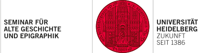

## Warum dieser Kurs?

Die Digitalisierung in der numismatischen Welt ist bereits weit fortgeschritten, doch die Verknüpfung heterogener Bestände bleibt eine Herausforderung. Dieser Kurs gibt Ihnen das Handwerkszeug, um in dieser digitalen Landschaft sicher zu navigieren, ohne dass informatische Vorkenntnisse nötig sind.

## Aufbau des Kurses

::::: {.grid}
:::: {.g-col-12 .g-col-md-6}
::: {.card}
::: {.card-body}
### 1. Basiswissen digitale Numismatik
**Inhalt** Forschungsdaten und Portalrecherche  
**Warum?** Datenquellen verstehen  

[Zum Kurs](digital_index.qmd){.btn .btn-primary}
:::
:::
::::

:::: {.g-col-12 .g-col-md-6}
::: {.card}
::: {.card-body}
### 2. Vage Münzdaten
**Inhalt** Umgang mit unsicheren und vagen Daten  
**Warum?** Auswertungen transparent und reproduzierbar machen  

[zum Kurs](vague_index.qmd){.btn .btn-primary}
:::
:::
::::
:::::

::: {.callout-note}
Die Module können in beliebiger Reihenfolge absolviert werden.   
Sie können jederzeit zurückspringen, ohne Ihren Fortschritt zu verlieren.
:::

## Technische Grundlage des Kurses

Dieser Kurs wurde mit **Quarto Live** geschrieben, das interaktive Übungen erlaubt.

::: {.callout-note collapse="true"}
## Mehr über den Kurs in Quarto Live
|   |   |
|---|---|
| Web‑basiert   | Der Kurs läuft komplett im Browser (Chrome, Firefox, Edge …). |
| Sicher        | Der Code wird in einer isolierten Web‑Assembly‑Umgebung ausgeführt – keine Daten verlassen Ihren Rechner. |
| Interaktiv    | Sie können Code‑Zellen anpassen und sofort das Ergebnis sehen. |

**Mehr erfahren:** <https://quarto.org/docs/computations/quarto-live.html>
:::

Die interaktiven Elemente des Kurses nutzen die Programmiersprache **Python**. Wenn Sie mit eigenen numismatischen Daten arbeiten möchten, ist Python ein guter Einstiegspunkt. Keine Angst, die Codezeilen sind sehr kurz und ausführlich erklärt, sodass Sie sich auch ohne Informatikkentnisse gut orientieren können. Python ist eine sprechende Programmiersprache und relativ einfach zu verstehen.

::: {.callout-note collapse="true"}
## Warum Python lernen?
|   |   |
|---|---|
| Einfach zu lesen   | Die Syntax ist fast wie ein Satz in natürlicher Sprache. |
| Große Community    | Viele Beispiele und Tutorials, speziell für die Digital Humanities. |
| Flexibilität       | Mit Bibliotheken wie `pandas`, `numpy` und `matplotlib` können Daten einfach verarbeitet und visualisiert werden. |

**Einsteiger‑Tutorial:** <https://www.python.org/about/gettingstarted/>  
:::

## Förderung {.appendix}

Diese ELearning-Materialien wurden am Zentrum für Antike Numismatik am Seminar für Alte Geschichte an der Universität Heidelberg entwickelt.

Finanziert wurde das Projekt in dem von der DFG geförderten Projekt NFDI4Objects - Forschungsdateninfrastruktur für die materiellen Hinterlassenschaften der Menschheitsgeschichte.{target="_blank"}

:::: {.columns .logo-row}

::: {.column}

:::

::: {.column}

:::

::: {.column}

:::

::::
